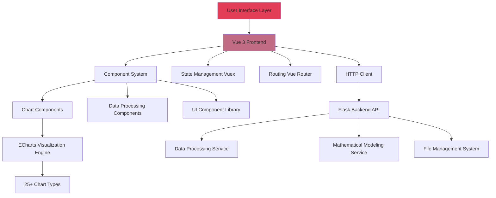

# 📊 AetherLab

[CN 中文](README.md) | [EN English](README.en.md)

> A powerful platform for data preprocessing, mathematical modeling, visualization, and chart generation, offering over 25 chart types and intelligent data processing along with standard mathematical modeling capabilities

**If you find this project interesting and want to follow its progress, please give it a star🌟!**

---

## 📋 Table of Contents

- [Overview](#-overview)
- [Features](#-features)
- [System Architecture](#-system-architecture)
- [Quick Start](#-quick-start)
- [Tech Stack](#-tech-stack)
- [Installation Guide](#-installation-guide)
- [Usage](#-usage)
- [Contributing](#-contributing)
- [License](#-license)

---

## 🎯 Overview

AetherLab is a modern data processing, modeling, and visualization platform. It offers an intuitive interface and powerful features, enabling users to quickly process data, view the modeling effects of standard models, and create data visualization charts.

---

## ✨ Features

### 🎨 Rich Chart Types
- **25+ Chart Types**: Line charts, bar charts, pie charts, scatter plots, radar charts, heatmaps, and more
- **Map Visualization**: Support for China city maps and world country maps
- **Custom Themes**: Multiple built-in themes with support for custom color schemes

### 📊 Data Processing
- **Multi-format support**: CSV, Excel, JSON, and other data formats
- **Data Preview**: Real-time preview and validation of uploaded data and processed data
- **History Tracing**: Supports undo and redo for data processing steps

### 📈 Mathematical Modeling
- **In development ..**

### 🔧 Flexible Configuration
- **Visual Configuration**: Easy chart parameter configuration through drag-and-drop and forms
- **Real-Time Preview**: Configuration changes are instantly reflected in the chart
- **Advanced Customization**: Support for deep customization of styles, animations, and interactions

### 💻 Modern Interface
- **Responsive Design**: Adapts to various screen sizes
- **Workspace Management**: Support for multi-file and multi-chart processing
- **Intuitive Operations**: Clean and user-friendly interface

---

## 🏗️ System Architecture



---

## 🚀 Quick Start

### Chart Generation Process

1. **Upload Data File**
   Click the "Files" button to upload data files in CSV, Excel, or other formats
   

2. **Check Data**
   Preview the uploaded data in the "Data Preview" panel to ensure it is correct
   

3. **Add to Workspace**
   Click the "Add to Workspace" button to add the selected file to your workspace
   

4. **Select Chart Type**
   Choose the appropriate visualization from 25+ chart types
   

5. **Open Structure Panel**
   Click the "Structure" button to open the chart structure panel
   

6. **Configure Chart**
   Set data mapping, styles, themes, and other parameters
   

7. **Generate Chart**
   Click the "Apply Configuration" button to create your visualization
   

8. **Customization**
   Adjust styles, themes, data filters and advanced settings to meet your needs
   

---

## 🛠️ Tech Stack

### Frontend
- **Framework**: Vue 3
- **State Management**: Vuex 4
- **Routing**: Vue Router 4
- **Visualization**: ECharts 5, Vue-ECharts
- **UI Components**: GridStack, VXE Table
- **Data Processing**: Papa Parse, XLSX
- **Internationalization**: Vue I18n
- **Build Tools**: Vue CLI, Babel, ESLint

### Backend
- **Framework**: Flask 3.1.1
- **CORS Support**: Flask-CORS
- **Logging**: Loguru
- **Packaging**: PyInstaller

---

## 📦 Installation Guide

### Prerequisites
- Node.js 14+ and npm
- Python 3.8+
- Git

### Clone Repository
```bash
git clone https://github.com/TiiJeiJ8/AetherLab.git
cd AetherLab
```

### Frontend Installation
```bash
cd frontend
npm install
```

### Backend Installation
```bash
cd backend
pip install -r requirements.txt
```

---

## 💡 Usage

### Development Mode

#### Start Frontend Development Server
```bash
cd frontend
npm run serve
```
Frontend will run at `http://localhost:8080`

#### Start Backend Server
```bash
cd backend
python App.py
```
Backend API will run at `http://127.0.0.1:8050`

### Production Build

#### Build Frontend
```bash
cd frontend
npm run build
```

#### Package Application (Optional)
```bash
cd backend
pyinstaller --onefile App.py
```

---

## 🤝 Contributing

Contributions are welcome! Please check our [Code of Conduct](CODE_OF_CONDUCT.md).

### Contribution Process
1. Fork this repository
2. Create your feature branch (`git checkout -b feature/AmazingFeature`)
3. Commit your changes (`git commit -m 'Add some AmazingFeature'`)
4. Push to the branch (`git push origin feature/AmazingFeature`)
5. Open a Pull Request

---

## 📄 License

This project is licensed under the Apache License 2.0 - see the [LICENSE](LICENSE) file for details.

---

## 👨‍💻 Author

**Created by TiiJeiJ8**

---

## ⭐ Star History

If this project helps you, please give it a star!

[](https://star-history.com/#TiiJeiJ8/AetherLab&Date)
