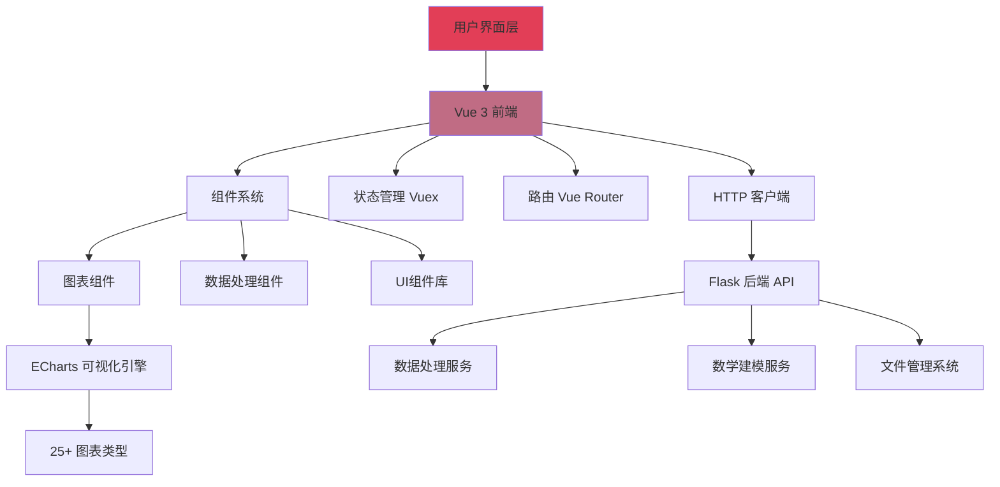

# 📊 AetherLab

[CN 中文](README.md) | [EN English](README.en.md)

> 一个强大的数据预处理、数学建模、可视化和图表生成平台，提供25+种图表类型和智能数据处理及普通数学建模功能

**如果你觉得这个项目有趣并想关注它的进展，请给它一个星🌟！**

---

## 📋 目录

- [概述](#-概述)
- [特性](#-特性)
- [系统架构](#-系统架构)
- [快速开始](#-快速开始)
- [技术栈](#-技术栈)
- [安装指南](#-安装指南)
- [使用说明](#-使用说明)
- [贡献](#-贡献)
- [许可证](#-许可证)

---

## 🎯 概述

AetherLab 是一个现代化的数据处理、建模、可视化平台。它提供了直观的界面和强大的功能，帮助用户快速处理数据、查看普通模型的建模效果、创建数据可视化图表。

---

## ✨ 特性

### 🎨 丰富的图表类型
- **25+ 种图表类型**：折线图、柱状图、饼图、散点图、雷达图、热力图等
- **地图可视化**：支持中国城市地图和世界国家地图
- **自定义主题**：多种内置主题，支持自定义配色方案

### 📊 数据处理
- **多格式支持**：CSV、Excel、JSON多种数据格式
- **数据预览**：实时预览和验证上传的数据及处理后的数据
- **历史回溯**： 支持数据处理步骤的撤销与重做

### 📈 数学建模
- **开发中...**

### 🔧 灵活配置
- **可视化配置**：通过拖拽和表单轻松配置图表参数
- **实时预览**：配置更改即时反映在图表上
- **高级定制**：支持深度定制样式、动画和交互效果

### 💻 现代化界面
- **响应式设计**：适配各种屏幕尺寸
- **工作区管理**：支持多文件、多图表同时处理
- **直观操作**：简洁友好的用户界面

---

## 🏗️ 系统架构



---

## 🚀 快速开始

### 图表生成流程

1. **上传数据文件**
   点击"文件"按钮上传 CSV、Excel 或其他格式的数据文件
   

2. **检查数据**
   在"数据预览"面板中预览上传的数据，确保数据正确
   

3. **添加到工作区**
   点击"添加到工作区"按钮将选定的文件添加到工作区
   

4. **选择图表类型**
   从25+种图表类型中选择合适的可视化方式
   

5. **打开结构面板**
   点击"结构"按钮打开图表结构配置面板
   

6. **配置图表**
   设置数据映射、样式、主题和其他参数
   

7. **生成图表**
   点击"应用配置"按钮创建可视化图表
   

8. **自定义调整**
   调整样式、主题、数据过滤器和高级设置以满足需求
   

---

## 🛠️ 技术栈

### 前端
- **框架**: Vue 3
- **状态管理**: Vuex 4
- **路由**: Vue Router 4
- **可视化**: ECharts 5, Vue-ECharts
- **UI组件**: GridStack, VXE Table
- **数据处理**: Papa Parse, XLSX
- **国际化**: Vue I18n
- **构建工具**: Vue CLI, Babel, ESLint

### 后端
- **框架**: Flask 3.1.1
- **跨域支持**: Flask-CORS
- **日志**: Loguru
- **打包**: PyInstaller

---

## 📦 安装指南

### 前置要求
- Node.js 14+ 和 npm
- Python 3.8+
- Git

### 克隆仓库
```bash
git clone https://github.com/TiiJeiJ8/AetherLab.git
cd AetherLab
```

### 前端安装
```bash
cd frontend
npm install
```

### 后端安装
```bash
cd backend
pip install -r requirements.txt
```

---

## 💡 使用说明

### 开发模式

#### 启动前端开发服务器
```bash
cd frontend
npm run serve
```
前端将运行在 `http://localhost:8080`

#### 启动后端服务器
```bash
cd backend
python App.py
```
后端 API 将运行在 `http://127.0.0.1:8050`

### 生产构建

#### 构建前端
```bash
cd frontend
npm run build
```

#### 打包应用（可选）
```bash
cd backend
pyinstaller --onefile App.py
```

---

## 🤝 贡献

欢迎贡献！请查看我们的 [行为准则](CODE_OF_CONDUCT.md)。

### 贡献流程
1. Fork 本仓库
2. 创建你的特性分支 (`git checkout -b feature/AmazingFeature`)
3. 提交你的更改 (`git commit -m 'Add some AmazingFeature'`)
4. 推送到分支 (`git push origin feature/AmazingFeature`)
5. 开启一个 Pull Request

---

## 📄 许可证

本项目采用 Apache License 2.0 许可证 - 查看 [LICENSE](LICENSE) 文件了解详情。

---

## 👨‍💻 作者

**Created by TiiJeiJ8**

---

## ⭐ Star History

如果这个项目对你有帮助，请给它一个星标！

[](https://star-history.com/#TiiJeiJ8/AetherLab&Date)