```mermaid
graph TB
    A[User Interface Layer] --> B[Vue 3 Frontend]
    B --> C[Component System]
    B --> D[State Management Vuex]
    B --> E[Routing Vue Router]
    
    C --> F[Chart Components]
    C --> G[Data Processing Components]
    C --> H[UI Component Library]
    
    F --> I[ECharts Visualization]
    I --> J[20+ Chart Types]
    
    B --> K[HTTP Client]
    K --> L[Flask Backend API]
    L --> M[Data Processing Service]
    L --> N[Mathematical Modeling Service]
    L --> O[File Management System]
    
    style A fill:#e23e57
    style B fill:#88304e
    style I fill:#522546
    style L fill:#311d3f

```

# 📊 AetherLab

❕Adopting a tightly coupled architecture for the front and back end has greatly increased the difficulty of maintenance and development, necessitating a restructuring of the architecture to decouple the front and back end. 💪

**New Arch is Developing**

**If you find this project interesting and want to follow its progress, please give it a star🌟!**

---

---

*Created by TiiJeiJ8*

