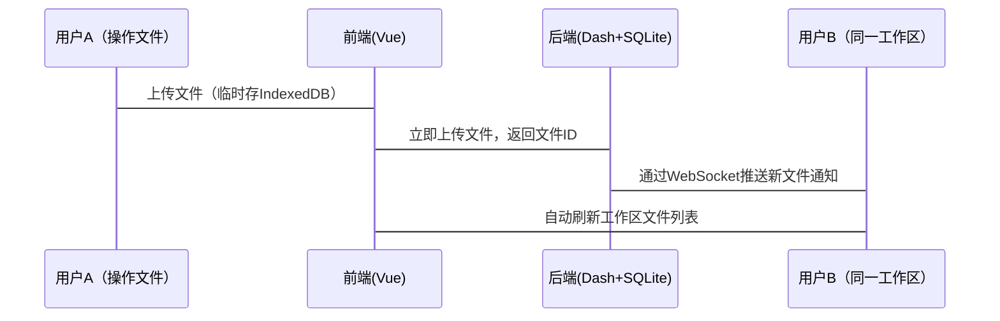
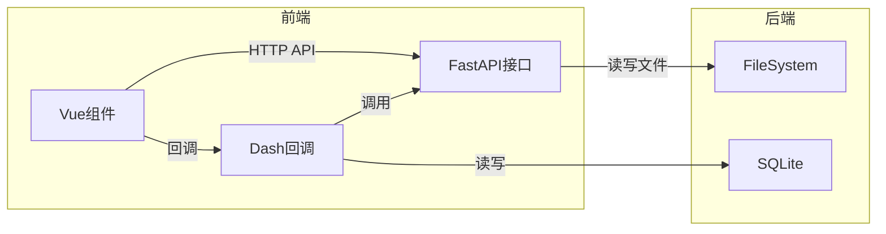

# Fuck Chart——轻量化个人/小团队工具、Dash+Vue混合架构、局域网协作

# 一、数据存储方案：后端为主 + 前端缓存的混合模式

## 核心原则

- **原始数据 & 计算结果 → 必须存后端**原因：支持多设备访问、工作区持久化、团队协作。
- **图表配置（源码） → 存后端**原因：需跨会话重现图表。
- **临时操作数据 → 存前端（如IndexedDB）**原因：加速交互，减少网络请求。

## 轻量化存储方案（无需额外服务）

| 数据类型 | 存储位置 | 技术方案 |
| --- | --- | --- |
| 用户上传的原始文件 | 后端文件系统 | 直接保存到服务器磁盘（按用户ID分目录） |
| 数据集元数据 | 后端SQLite数据库 | Dash内置SQLite管理文件路径、描述信息 |
| 图表配置JSON | 后端SQLite数据库 | 直接存储JSON文本 |
| 临时预览数据 | 前端IndexedDB | Vue插件（如localForage） |

> 优点：零依赖外部服务（如S3/Redis），仅用Python标准库（sqlite3+文件操作）实现。
>

---

# 二、团队协作同步方案

## **你提出的方案分析**

> “用户上传后本地存副本 → 工作区显示未上传文件 → 确认后同步到后端”
优点：避免误操作覆盖数据，适合网络不稳定的环境。
缺点：未上传文件无法被其他成员看到，协作时可能混乱。
> 

## **改进方案：实时同步 + 冲突检测**



## **关键实现：**

1. **实时同步**：
    
    用WebSocket（如Flask-SocketIO）推送文件变更。
    
2. **冲突处理：**
    - 文件重名时自动重命名（如data(1).csv）。
    - 多人编辑同一图表时锁定（类似Google Docs）。
3. **离线支持：**
    
    前端未上传的操作存IndexedDB，网络恢复后自动同步。
    

---

# 三、Dash框架下的前后端通信详解

## 基础通信模式

Dash本质是Flask应用，通信依赖两种机制：

- Dash回调：前端组件 → Python函数（适合简单操作）
- REST API： Vue → 独立Python接口（适合文件上传等复杂操作）

## 混合架构通信方案



### 具体场景实现

### 场景1：上传文件（Vue → FastAPI）

```python
# main.py
from fastapi import FastAPI, UploadFile, File
import os

app = FastAPI()

UPLOAD_DIR = "uploads"

# 确保上传目录存在
os.makedirs(UPLOAD_DIR, exist_ok=True)

@app.post("/upload")
async def upload_file(file: UploadFile = File(...)):
    content = await file.read()
    save_path = os.path.join(UPLOAD_DIR, file.filename)
    
    with open(save_path, "wb") as f:
        f.write(content)

    return {"file_id": file.filename}
```

```jsx
// Vue中使用axios调用
axios.post("http://localhost:8000/upload", formData)
```

### 场景2：获取工作区文件列表（Dash回调）

```python
// Dash Layout 示例（配合使用）
import dash
from dash import html, dcc, Output, Input
import os

app = dash.Dash(__name__)

app.layout = html.Div([
    html.Button("刷新文件列表", id="refresh-button"),
    dcc.Store(id="file-list"),
    html.Ul(id="file-list-display")
])

// 回调函数：刷新文件列表并显示
@app.callback(
    Output('file-list', 'data'),
    Input('refresh-button', 'n_clicks'),
    prevent_initial_call=True
)
def get_file_list(n_clicks):
    try:
        files = os.listdir("uploads/")
        return {"files": files}
    except Exception as e:
        return {"files": [], "error": str(e)}

// 再加一个回调：把文件名渲染出来
@app.callback(
    Output('file-list-display', 'children'),
    Input('file-list', 'data')
)
def display_file_list(data):
    if not data or 'files' not in data:
        return [html.Li("没有文件")]
    return [html.Li(f) for f in data['files']]
```

### 场景3：实时同步（WebSocket）

```python
# Flask-SocketIO实现（与Dash共享app）
from flask_socketio import SocketIO, emit

socketio = SocketIO(app)

@socketio.on('file_uploaded')
def handle_message(data):
	emit('new_file', data, broadcast=True)  # 广播给所有客户端
```

```jsx
// Vue中监听事件
const socket = io("http://localhost:5000");
socket.on("new_file", (data) => {
	this.files.push(data.filename); // 更新文件列表
});
```

---

# 四、轻量化部署建议数据存储路径

### 数据存储路径

```bash
project/
├── uploads/       # 存放用户文件
├── db.sqlite      # SQLite数据库
└── app.py         # Dash+FastAPI主程序
```

### 依赖清单

```python
# requirements.txt
dash==2.0.0
fastapi==0.85.0
uvicorn==0.19.0
flask-socketio==5.3.2
aiofiles==22.1.0   # 异步文件处理
```

# 五、总结建议

- **存储策略**
    - 原始数据/图表配置 → 后端文件系统 + SQLite
    - 临时数据 → 前端IndexedDB
- **协作同步**
    - WebSocket实时推送变更 + 离线自动重试
    - 文件冲突时自动重命名
- **通信方案**
    - 简单交互：Dash回调
    - 文件/异步操作：独立FastAPI接口 + WebSocket
- **轻量化关键**
    - 用SQLite替代MySQL，文件系统替代S3
    - 单文件部署（避免Celery，改用线程池处理异步任务）

> 此方案在满足协作需求的同时，最大程度保持轻量化（仅Python标准库+少量轻量级包），且能直接部署在树莓派等设备上运行。
> 

---